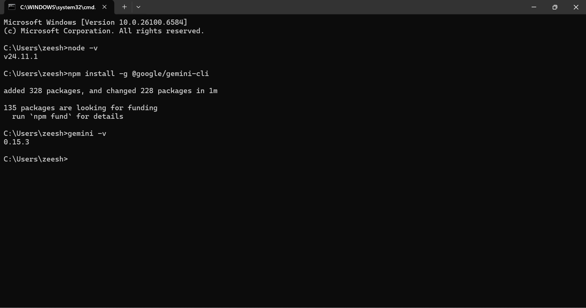
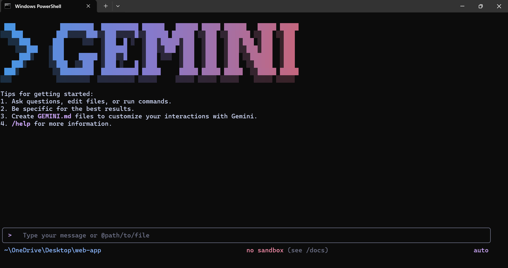
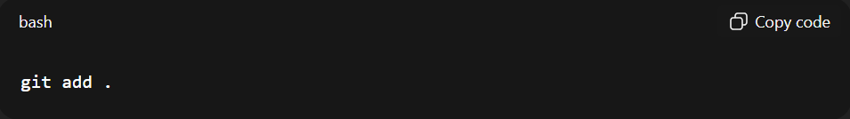
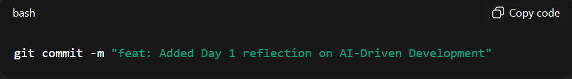
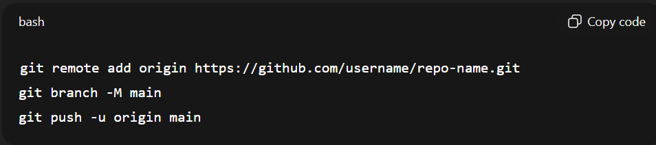

# 🧠 AIDD 30-Day Challenge — Task 1 Submission
    Name: Tayyaba Hussain | Student ID: 00042883
    ⏱ Time: 1 Hour | Marks: 10 | Deadline: 48 Hours
    📅 Class Slot: Friday — 6:00 PM to 9:00 PM
    Instructor: Sir Hamzah Syed
 
# 🚀Understanding the AI-Native Turning Point
 
## 🎯Goal

 Understand what AI-Driven Development (AIDD) means and how the October 2025 AI
 Turning Point changed the role of software developers forever.
 
## 📘Study Material (20–25 min)
 
### Resources
 
 🔗AI-Native Book  — Preface: "Welcome to the AI-Native Era"
 
## Focus

<li> How AI and human creativity combine to create a new AI-Native Era
<li> Why developers are now becoming AI collaborators, not just coders
<li> What made October 2025 the global AI Turning Point
 
## 🧩Key Concepts to Understand
 
### Concept
1. AI Turning Point (Oct 2025)

        When AI tools like ChatGPT, Gemini, and Claude made AI assisted development mainstream.

2. Agentic AI

        AI systems that can reason, plan, and act autonomously.

3. Evaluation-Driven Development (EvDD)

        Development style that evaluates and improves AI generated outputs.

4. Test-Driven Development (TDD)

        Classic testing-first approach — still key in AI workflows.

5. AI Productivity Boom
 
        Developer productivity increased 5–10× through AI coding agents.

## 🧩Key Concepts Explained
# 🧠 1. What is AI-Driven Development?

AI-Driven Development means:
 Developers work together with AI.
 AI helps you write code, fix code, generate ideas, test code, and improve it.
 Developer’s job → Think
 AI’s job → Write, fix, test, improve
 It’s teamwork between you and AI.
 
# 🚀 2. October 2025 – The AI Turning Point 

October 2025 was a big moment in the tech world.
 In this month:
<li> AI tools became extremely powerful (ChatGPT, Gemini, Claude, DeepSeek)
<li> AI could create full apps, websites, and agents
<li> AI became fast, accurate, and widely used
<li> Almost every developer started using AI daily

 Because of this →
 The world said this is the “AI Turning Point.”
 
 Developers started working faster (5–10 times) and smarter.
 
# 🤖 3. What is Agentic AI?

 Agentic AI means:
 AI that can think, plan, and finish tasks by itself.
 
 Example: You tell AI:
 “Make a login system, fix errors, test it, and create documentation.”
 And the AI does everything step-by-step without your help.
 It behaves like a real assistant or teammate.

# 🧪 4. What is Evaluation-Driven Development (EvDD)?
 
 EvDD means:
  AI creates something → you check it → you tell AI to improve it.

 Your job → Check AI’s work
 
 Tell AI what to improve
 Make sure output is correct
 
 AI writes the code…
 You guide the quality.
 
# 🧪 5. What is Test-Driven Development (TDD)?
 
 TDD means:
  
  First write tests → then write code.
 
 In AI era:
<li> You write the tests
<li> AI writes the code that passes those tests

# ⚡ 6. The AI Productivity Boom
 
 After AI tools became powerful:
 
<li> Work that took 5 hours → now takes 30 minutes
<li> Bugs can be resolved instantly
<li> AI explains errors
<li> AI writes whole modules
<li> Updating projects becomes easier
<li> Developers became faster and more productive.

# ❤ In Simple Words:
 AI is not replacing developers.
 AI is helping developers.
 Developers are now problem-solvers, planners, and decision-makers.
 Coding is no longer about typing code — it’s about thinking smarter and
 working with AI.

# 🧰 Environment Setup (Optional – Before You Start) 
Install the Google Gemini CLI for hands-on AI tasks:

 ```
 bash

 npm install -g @google/gemini-cli
 ```

✅ Check installation:
 
 ```
 bash

 gemini --version
 ```

🚀 Successfully Installation

 

 

# ✍ Reflection Activity (40 min)
 Write your reflection in your own words:
<li> What does AI-Driven Development mean to you?
<li> How do you see the future of Human–AI Collaboration in software
 development?

# ✍ My Opinion About  AI-Driven Development (AIDD)
 When I think about AI-Driven Development, it feels like the beginning of a
 completely new era in software development. For me, AIDD means working
 with AI, not against it. It means I no longer have to spend most of my energy
 writing syntax or debugging line-by-line. Instead, my role shifts toward
 thinking, guiding, evaluating, and making strategic decisions and letting AI
 handle the heavy and repetitive work.

 After learning about the AI-Native Era and the October 2025 Turning Point, I
 realized that this moment really changed everything for developers around the
 world. AI wasn’t just a “tool” anymore  it became a true collaborator. Coding
 agents, reasoning models, and autonomous workflows made development
 faster, smarter, and more creative. Developers who previously worked alone
 now suddenly had a powerful partner that could ideate, plan, generate, test,
 and even optimize code.

 To me, the most important shift is from being a coder to becoming a problem
 solver. AI can generate code, but it still needs a human to provide context,
 direction, and meaningful evaluation. This is where the future of Human–AI
 collaboration begins. I see developers acting more like architects, strategists,
 and decision-makers. We will design ideas, define the intent, and evaluate the
 AI’s output while AI takes care of implementation, debugging, and improvement.
 
 Agentic AI also fascinates me because it behaves more like a teammate that can
 think, plan, and complete tasks independently. Instead of micromanaging the
 system, developers will orchestrate and supervise entire workflows. And with
 Evaluation-Driven Development (EvDD), our main responsibility becomes judging
 the quality of the AI’s output and pushing it to produce something better.
 
 The future feels exciting instead of intimidating. AI is not here to replace
 developers — it is redefining us. The skills that matter today are reasoning,
 critical thinking, creativity, and the ability to guide AI through well-designed
 prompts and feedback. The more we learn to collaborate with AI, the more
 productive, innovative, and impactful we can become.
 
 If the 2025 Turning Point taught us anything, it’s that coding is no longer just
 about writing instructions it’s about understanding problems, driving intelligent
 systems, and shaping the next generation of technology with AI at our side.
 
# 💻 Optional Practice (VS Code – 10 min)
 Start tracking your learning journey like a real project. 

#### 🎯 Goal: Learn how developers use Git to log their AI learning progress.

 ```
 bash

 echo "Hello, AI World" > day1_intro.txt
 git init
 git add day1_intro.txt
 git commit -m "Day 1 - Start of AIDD Journey"
 ```
To practice how developers use Git to log their AI learning progress, you can
 start a simple Git workflow inside your project folder.

#### ✔ Step-by-Step Git Commands
 1. Initialize a new Git repository

 
 Creates a new Git repo where your learning progress will be tracked.

 2. Add your files to the staging area

 
 This tells Git which files you want to include in the next commit.

 3. Create your first commit

 
 A clear, professional commit message showing what you accomplished.

 4. View your commit history

 
 Shows a simple list of your completed progress checkpoints.

 5. Connect to GitHub

 
 This uploads your learning journey to GitHub, making it part of your public portfolio.

## 🌟 Why This Matters
 Using Git this way helps you build the same habits professional developers use
 every day:
<li> clean commit messages
<li> organized progress tracking
<li> portfolio-ready documentation
<li> version control discipline
 
# 🧠 Self-Test (MCQs)
 1: What is the main purpose of the AI-Native Era?
 
 a) Replace developers
 
 b) Empower developers through AI tools
 
 c) Eliminate coding
 
 d) Automate testing
 
### Answer
        ✅ b) Empower developers through AI tools
 
 2: What defines an AI-driven developer?
 
 a) Writes only syntax
 
 b) Creates context-aware prompts
 
 c) Avoids tools
 
 d) Works offline
 
### Answer
        ✅ b) Creates context-aware prompts
 
 3: What does “AIDD” stand for?
 
 a) AI-Integrated Data Design
 
 b) AI-Driven Development
 
 c) Automated IDE Deployment
 
 d) Adaptive Input Debugger

### Answer
    ✅ b) AI-Driven Development
 
 4: What is the focus of Evaluation-Driven Development (EvDD)?
 
 a) Manual coding
 
 b) Evaluating and improving AI outputs
 
 c) UI design
 
 d) Testing only
 
### Answer
    ✅ b) Evaluating and improving AI outputs
 
 5: What should developers focus on in the AI era?
 
 a) Syntax only
 
 b) Building reasoning + evaluation skills
 
 c) Avoiding AI tools
 
 d) Manual workflows
 
### Answer
    ✅ b) Building reasoning + evaluation skills

# 💬 End-of-Day Reflection
 “Today I learned that AI isn’t replacing developers — it’s redefining them. 
The 2025 Turning Point proved that coding is no longer just syntax; 
it’s about reasoning, collaboration, and strategy.”