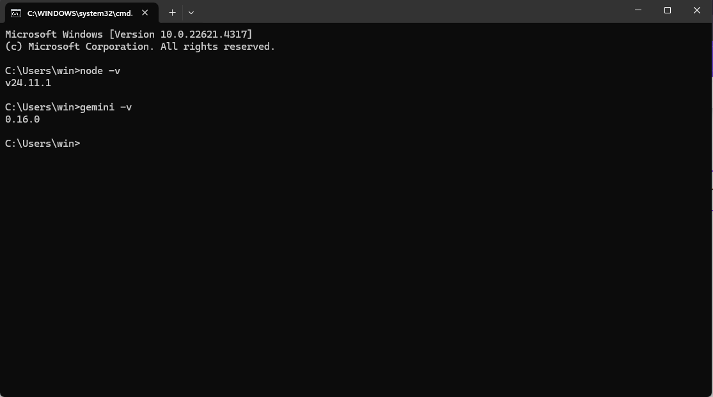
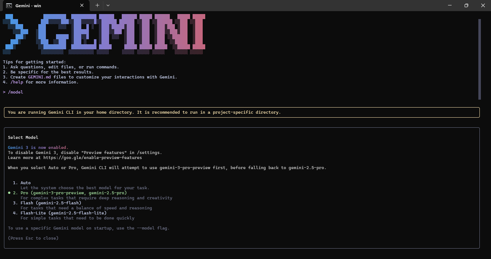

 # 🧠 AIDD 30-Day Challenge — Task 3 Submission
    Name: Tayyaba Hussain | Student ID: 00042883
    ⏱ Time: 1 Hour | Marks: 10 | Deadline: 48 Hours
    📅 Class Slot: Friday — 6:00 PM to 9:00 PM
    Instructor: Sir Hamzah Syed

 # 🌟 PART A — Research Questions (Short Answers)

Note: Students must research Gemini 3.0 from official Google AI sources and
developer documentation.

 ## Question 1:
 What new improvements were introduced in Gemini 3.0?

 ## Answer:
 Gemini 3.0 introduces major improvements in reasoning, multimodal understanding, and agentic capabilities. It can now plan and execute multi-step tasks, handle complex text, images, videos, and spatial data accurately, and integrate seamlessly with developer tools like AI Studio, Vertex AI, CLI, and Antigravity. It is more reliable, accurate, and reduces hallucinations in complex workflows.

 ## Question 2:
 How does Gemini 3.0 improve coding & automation workflows?
 
 ## Answer:
 Gemini 3.0 improves coding and automation by allowing agents to write, test, and debug code autonomously. It supports multi-file and multi-step workflows, automates repetitive tasks, and integrates with developer tools to streamline the development process. Reasoning improvements make coding faster, more accurate, and easier to manage.
 
 ## Question 3:
 How does Gemini 3.0 improve multimodal understanding?
 
 ## Answer:
 Gemini 3.0 has advanced multimodal capabilities. It can understand text, images, videos, diagrams, tables, and other mixed media accurately. Complex spatial data and layered visuals are processed more reliably, making it suitable for realworld applications, interactive tasks, and agent-driven workflows. 

 ## Question 4:
 Name any two developer tools introduced with Gemini 3.0.
 
 ## Answer:
 <li> Antigravity Developer Environment
 
 An agent-first IDE where Gemini agents can code, debug, run terminal commands, and execute browser actions autonomously.

 <li> Gemini CLI / API
 
 Updated CLI and APIs for better automation, multi-step workflows, faster
 responses, and seamless integration with development pipelines.

# 🌟 PART B — Practical Task (Screenshot Required)
 ### Task:
 You must complete the following steps:
 <li> Update the Gemini 3.0 model
 <li> Using the /model command in Gemini CLI, update the Gemini model to the latest version (3.0).

Note: You do not need to update the CLI itself; only the model should be updated.

 # 📱Screenshots

 ✅ Check Installed Node & Gemini CLI Version:

 
 
 🚀 Successfully Updated Gemini 3.0 Model
 
 