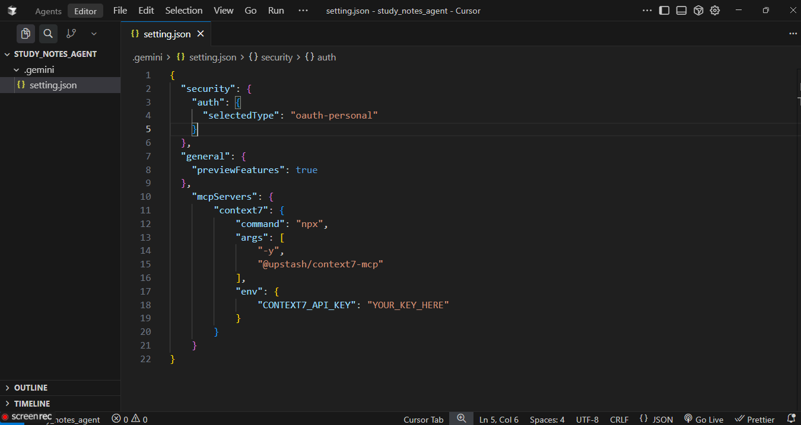
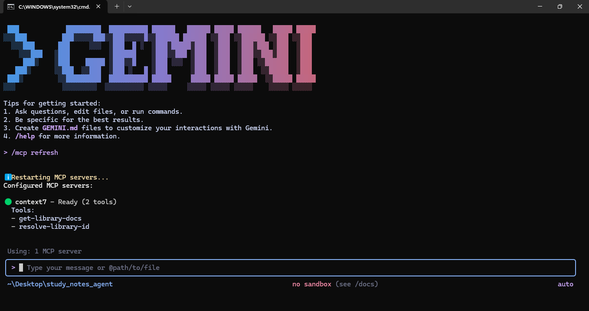

 # 🚀🚀 Task 4 — Connecting Context7 MCP Server to Gemini CLI

 For today’s task, you will connect the **Context7 MCP server** to your **Gemini CLI**.

### 🌟 Setting.json File

### ✅ Successfully MCP Configuration
