 # 🧠 AIDD 30-Day Challenge — Task 6 Submission
    Name: Tayyaba Hussain | Student ID: 00042883
    ⏱ Time: 1 Hour | Marks: 10 | Deadline: 48 Hours
    📅 Class Slot: Friday — 6:00 PM to 9:00 PM
    Instructor: Sir Hamzah Syed

 # 🎯 Task Objective
 Students will connect GitHub MCP Server with the Google Gemini CLI using the Hosted (Remote) MCP Server.
 
 This method does not require Docker or MCP installation - it's the simplest method.
 
 After completing this task, AI will be able to read repositories and interact with GitHub.
 
 # 📌 Steps to Complete Task 6 (Easy Method)
 ## 🔹 Step 1 - Create Your GitHub Personal Access Token (PAT)
 
 ### Open this link:
 https://github.com/settings/tokens

 #### Generate a token with:
  ✔ repo (Read & Write)

 Copy the token and save it safely.

 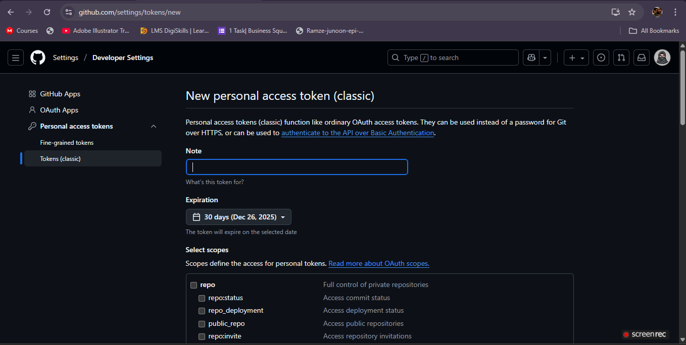
 
 #### 🗒️ Token Name

 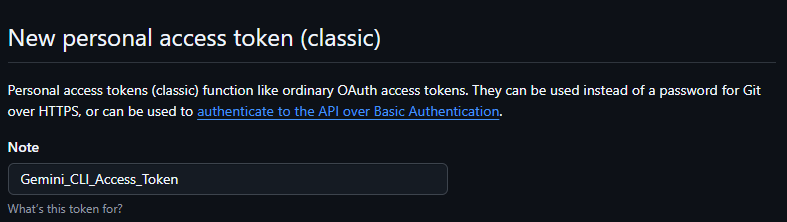
 
 #### 📝 Some Permissions

 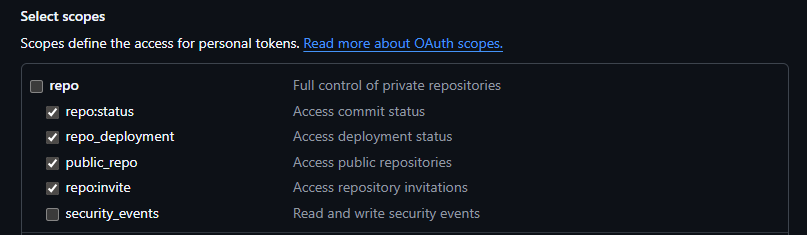

 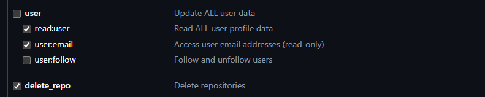
 
 #### ✅Successfully Generate Token

 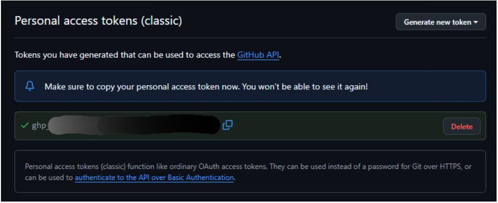
 
 ## 🔹 Step 2 - Store Your Token Securely
 
 Do NOT put the token directly into JSON.
 
 ### 📂 Create this file:
 
 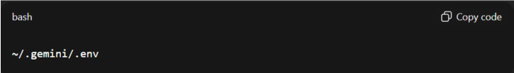

 ### ➕ ADD

 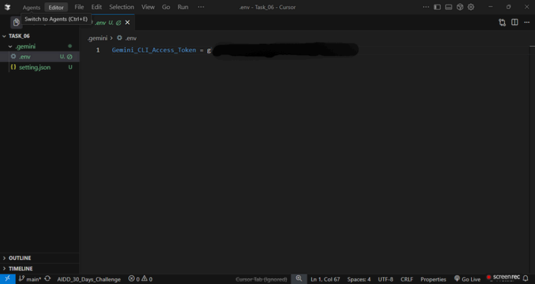
 
 ## 🔹 Step 3 - Configure Gemini to Use GitHub MCP Server
 ### 🗃️ Open or create:

 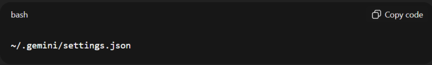
 
 ### 📄Paste this:

 
 
 ✔ No installation required
 
 ✔ Token auto-loads from .env
 
 ✔ Fast & easiest MCP setup
 
 ## 🔹 Step 4 - Restart Gemini CLI

 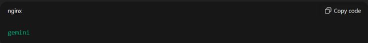
 
 ## 🔹 Step 5 - Verify Connection
 
 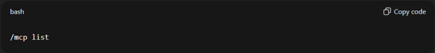

 ### 🔧 Tools List

 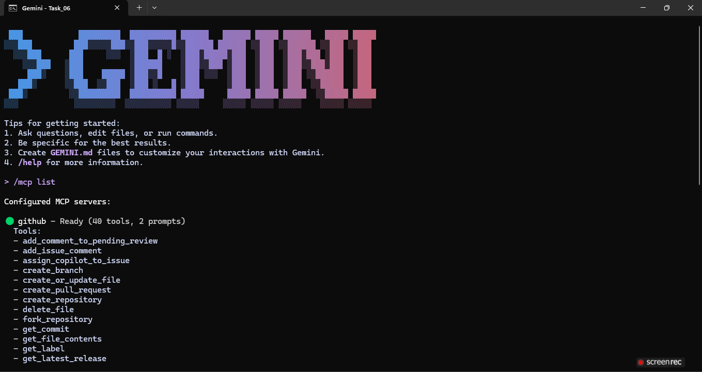

 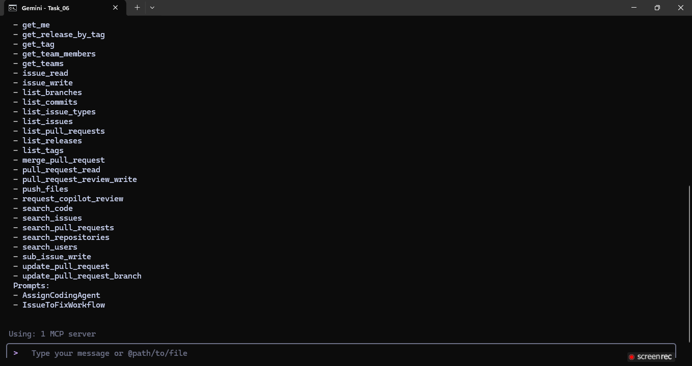
 
 ## 🔹Step 6 - Test the Server

 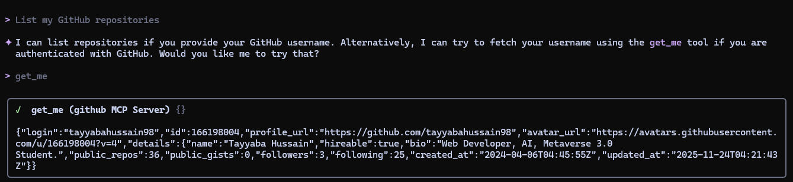
 
 ### 🚀 Gemini shows your repos → MCP is fully connected ✔

 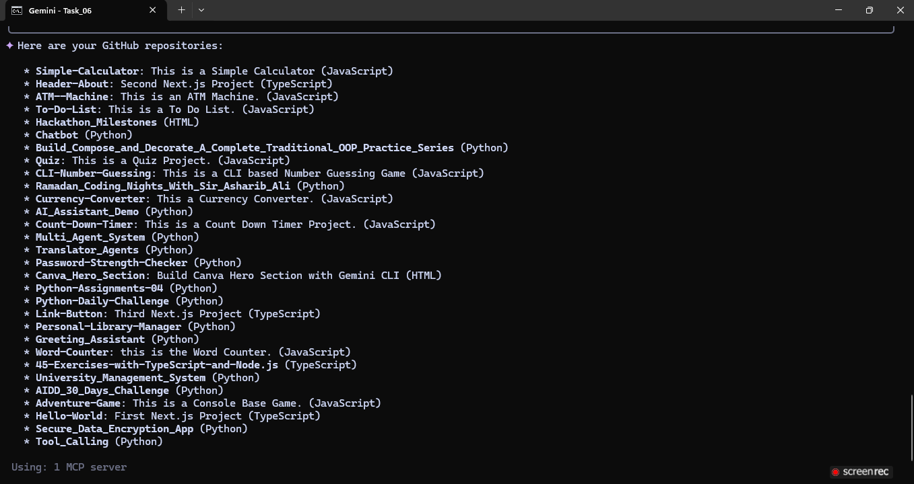
 
 ## 📤 Submission Requirements
 
 ### Students must submit:
 
 #### ✔ Screenshot of:
 ✅ .env file (token blurred)
 
 ✅ settings.json
 
 ✅ /mcp list result
 
 ✅ GitHub repo list output