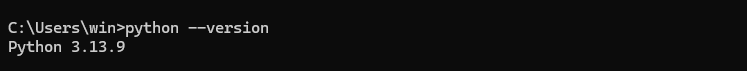
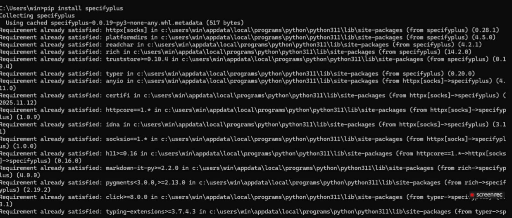
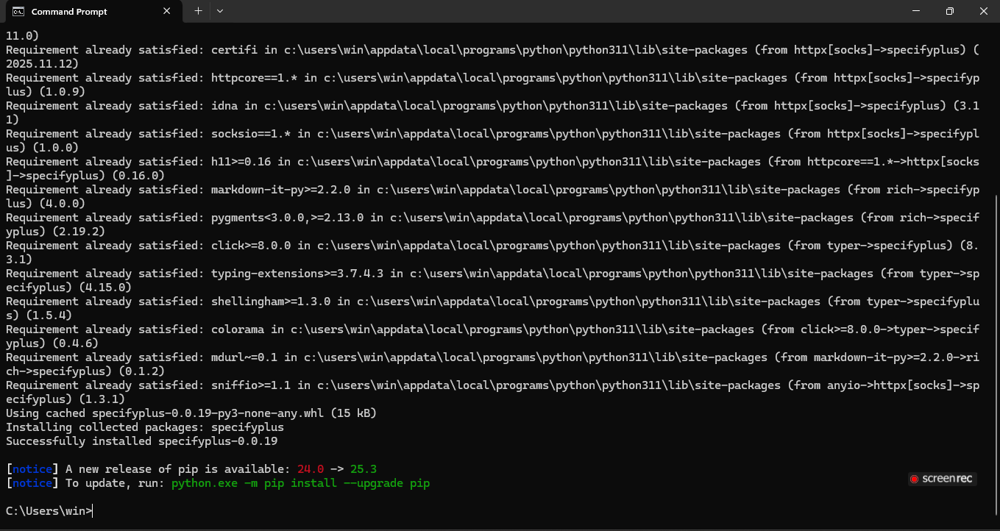
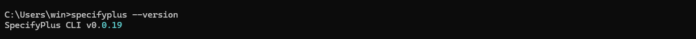
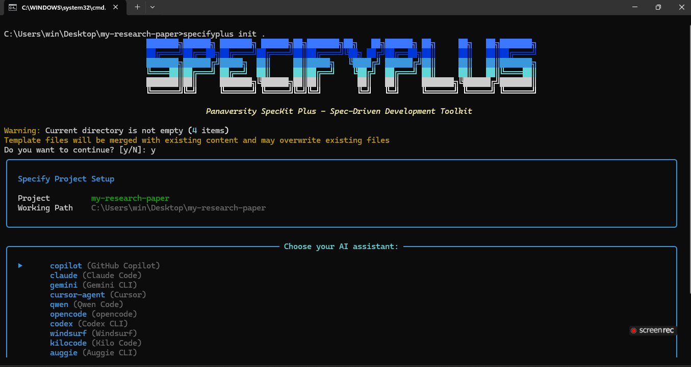
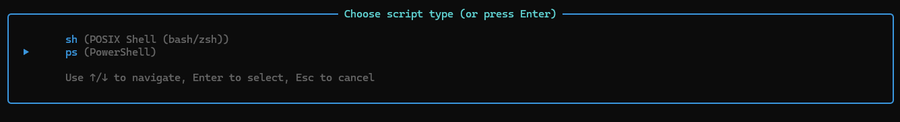
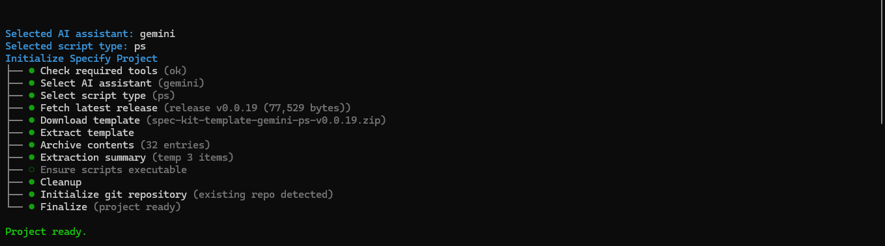

 # 🧠 AIDD 30-Day Challenge — Task 3 Submission
    Name: Tayyaba Hussain | Student ID: 00042883
    ⏱ Time: 1 Hour | Marks: 10 | Deadline: 48 Hours
    📅 Class Slot: Friday — 6:00 PM to 9:00 PM
    Instructor: Sir Hamzah Syed
    
 # 🎯 Task Overview
 
 🔹What is **SPECKit Plus**? – Write a short note Students must download SPECKit and review the 5 core concepts included in it:

    1. /constitution
    2. /specify
    3. /plan
    4. /tasks
    5. /implement

 After reviewing these concepts, students must write a short answer for each concept.
 
 ## 📤 Submission Requirements
 
 ✔ Short note for SPECKit Plus
 
 ✔ Short answers for each of the 5 concepts
 
 ✔ Submit in Discord → Task 7 → Comments Section
 
 ✔ OR submit via GitHub README.md
 
 ### Resources (Clickable Links)
 #### 🔧 Installation
 https://ai-native.panaversity.org/docs/SDD-RI-Fundamentals/spec-kit-plushands-on/installation-and-setup

 #### 📜 Constitution Phase
 https://ai-native.panaversity.org/docs/SDD-RI-Fundamentals/spec-kit-plushands-on/constitution-phase

 #### ✏ Specify Phase
 https://ai-native.panaversity.org/docs/SDD-RI-Fundamentals/spec-kit-plushands-on/specify-phase
 
 #### 🧠 Plan Phase
 https://ai-native.panaversity.org/docs/SDD-RI-Fundamentals/spec-kit-plushands-on/plan-phase
 
 #### 📝 Tasks Phase
 https://ai-native.panaversity.org/docs/SDD-RI-Fundamentals/spec-kit-plushands-on/tasks-phase
 
 #### ⚙ Implement Phase
 https://ai-native.panaversity.org/docs/SDD-RI-Fundamentals/spec-kit-plushands-on/implement-phase

 ## 🔽 SPECKit Plus Installation
 
 ### 🌟 Step 1: Ensure Python Version
 Make sure Python 3.11 or higher is installed on your system.

 
 
 ### 🌟 Step 2: Install SPECKit Plus
 Open your terminal / command prompt.
 
 Run the command:

 ```
 bash
 
 pip install specifyplus

 ```

 ##### Wait for the installation to complete.
 
 

 
 
 ### 🌟 Step 3: Verify Installation
 To check the installed version of SPECKit Plus, run:
 ```
 bash
 
 specifyplus --version
 
 ```
 If the version is displayed, the installation is successful.

 
 
 ### ✅ SPECKit Plus Installed Successfully

 

 

 

 # ⭐ What is SPECKit Plus?

 ### Answer:
 *SPECKit Plus* is a structured **AI-first framework**  that guides you step-by-step in
 building software using AI. It gives a proper sequence of phases so your project becomes clear, organized, and AI-friendly. It removes confusion and ensures that the final output matches your real requirements.
 
 It helps you break a project into:
 <li> clear definitions
 <li> proper planning
 <li> small tasks
 <li> and final implementation

 So that AI can follow everything easily and produce high-quality results.

 # 🌟 5 Core Concepts of SPECKit Plus
 ## ✨ 1. Constitution Phase (/sp.constitution)
 The *Constitution Phase* defines the foundation of the project.
 
 In this phase, you identify:
 <li> the purpose of the project
 <li> the boundaries and constraints
 <li> the stakeholders
 <li> success criteria
 <li> the overall identity of the system
 
 This phase ensures that the project direction is 100% clear before development begins.
 
 Its output is a well-defined project constitution that sets the roadmap for everything that follows.
 
 ## ✨ 2. Specify Phase (/sp.specify)
 The *Specify Phase* focuses on writing precise and unambiguous system requirements.
 
 Here you define:
 <li> what the system will do
 <li> how it will behave
 <li> inputs and outputs
 <li> rules, scenarios, and constraints
 
 This phase removes all uncertainty and gives the AI a crystal-clear blueprint to follow.
 
 The output is a **spec.md** file containing detailed system specifications.
 
 ## ✨ 3. Plan Phase (/sp.plan)
 The *Plan Phase* defines how the system will be implemented.
 
 In this phase, you determine:
 <li> the architecture
 <li> the tech stack
 <li> modules and components
 <li> workflows
 <li> directory structure
 
 This ensures the development process is organized and not random.
 
 The output is a **plan.md** file describing the full implementation plan.
 
 ## ✨ 4. Tasks Phase (/sp.tasks)
 The *Tasks Phase* breaks the entire project into small, manageable, testable tasks.
 
 Each task becomes:
 <li> clear
 <li> trackable
 <li> actionable
 <li> easy to verify
 
 This phase creates a step-by-step task list that the AI can follow without confusion.
 
 The output is a **tasks.md** file that acts as the implementation checklist.
 
 ## ✨ 5. Implement Phase (/sp.implement)
 The *Implementation Phase* converts everything into actual working code.
 
 During this phase, SPECKit Plus:
 <li> verifies the specifications and plan
 <li> uses the RED–GREEN–REFACTOR (TDD) process
 <li> completes tasks one by one
 <li> performs checks and validations
 <li> ensures all tests pass
 
 The output of this phase is fully functional, tested, and production-quality code that follows the exact requirements defined earlier.