 # 🧠 AIDD 30-Day Challenge — Task 8 Submission
    Name: Tayyaba Hussain | Student ID: 00042883
    ⏱ Time: 1 Hour | Marks: 10 | Deadline: 48 Hours
    📅 Class Slot: Friday — 6:00 PM to 9:00 PM
    Instructor: Sir Hamzah Syed
    
 # 🎯 Task Overview
 Build a calculator using SpecKitPlus, and complete all 5 phases:
 1. /constitution
 2. /specify
 3. /plan
 4. /tasks
 5. /implement
 
 # 📋 Submission Instructions
 Combine all your outputs from the 5 phases into a single .md file (GitHub
 Markdown file).
 
 Attach 3 screenshots showing your calculator tests inside the .md file.
 
 Submit the .md file on Discord → Task 8 → Comments Section.
 
 # ✨ Constitution Phase
 ### <li> Prompt:

 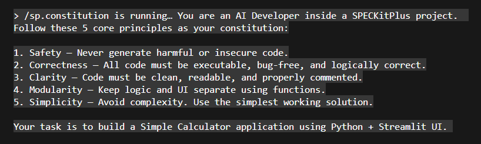
 
 ### <li> Claude Output:
 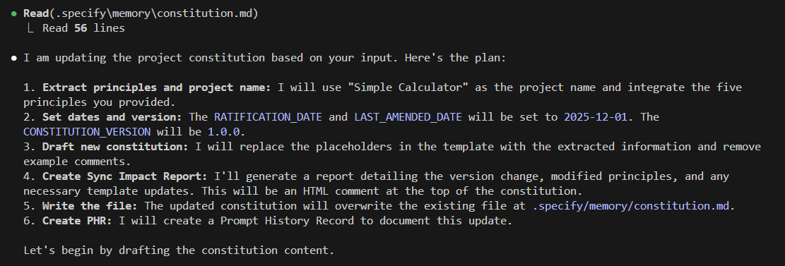
 
 # ✨ Specify Phase
 ### <li> Prompt:

 
 
 ### <li> Claude Output:

 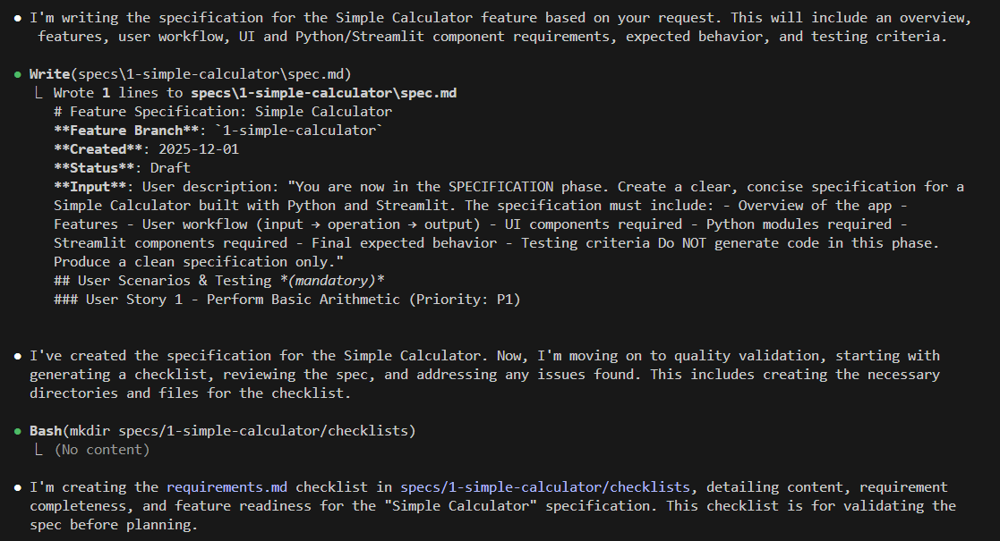
 
 # ✨ Plan Phase
 ### <li> Prompt:
 
 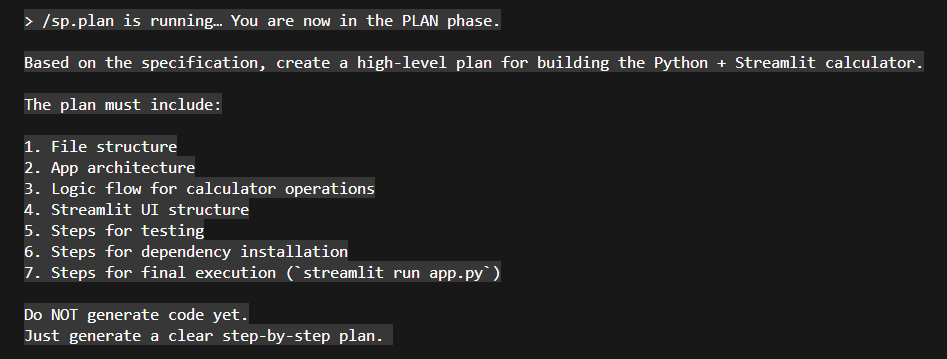

 ### <li> Claude Output:

 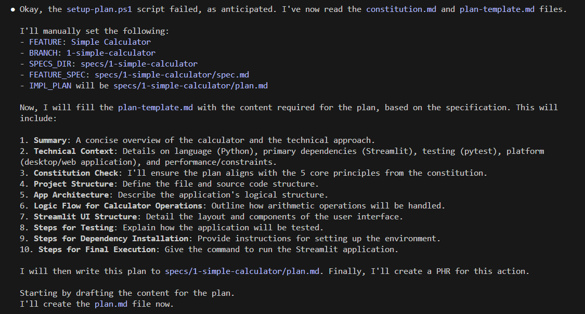
 
 # ✨ Tasks Phase
 ### <li> Prompt:

 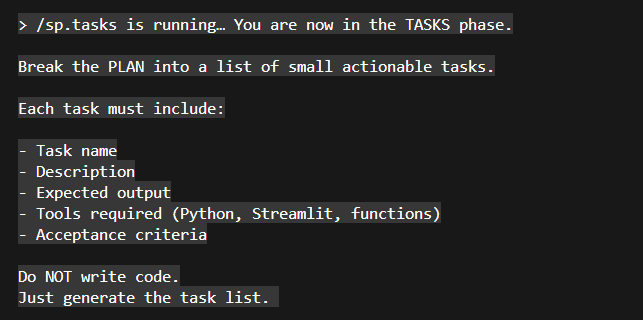
 
 ### <li> Claude Output:

 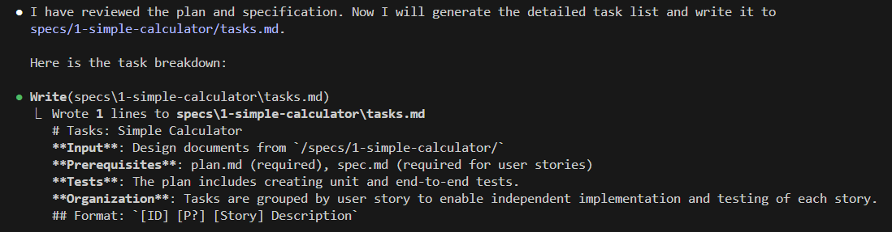

 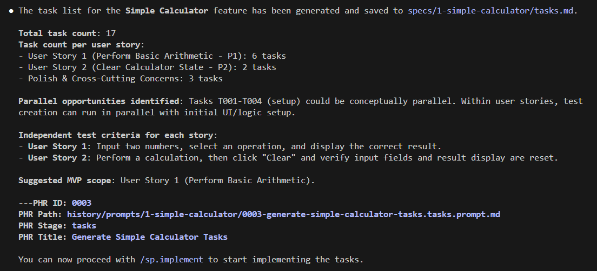
 
 # ✨ Implement Phase
 ### <li> Prompt:

 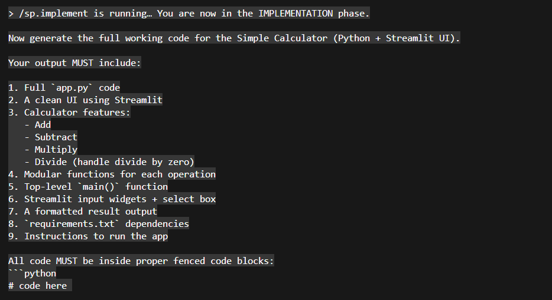
 
 ### <li> Claude Output:

 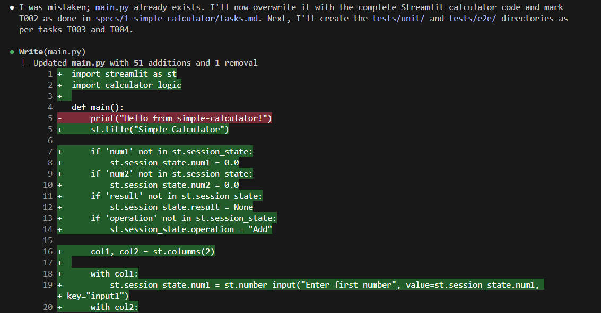

 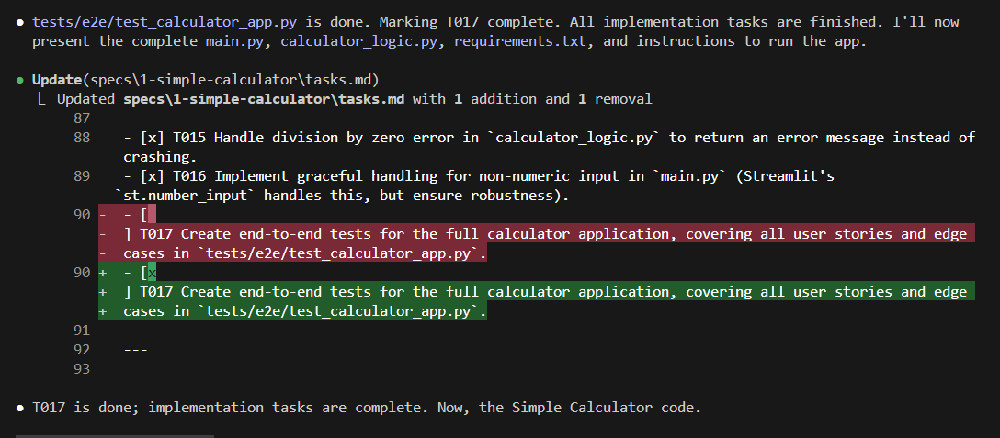
 
 # 🌟Final Testing Screenshots
 
 ### 💫 Addition Test:

 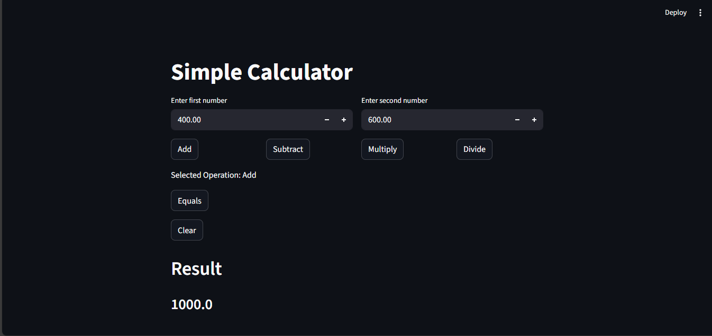
 
 ### 💫 Subtraction Test:

 
 
 ### 💫 Multiplication Test:

 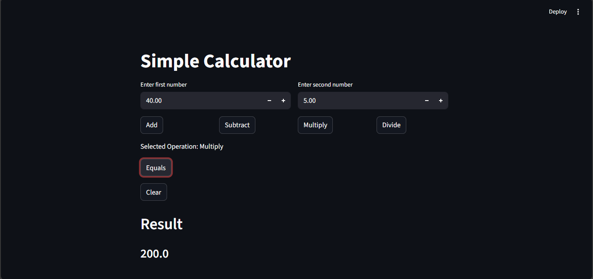
 
 ### 💫 Division Test:

 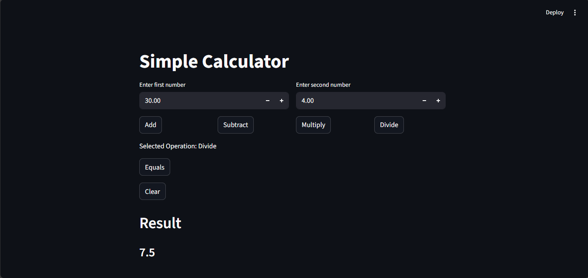