 # 🧠 AIDD 30-Day Challenge — Task 9 Submission
    Name: Tayyaba Hussain | Student ID: 00042883
    ⏱ Time: 1 Hour | Marks: 10 | Deadline: 3 Days
    📅 Class Slot: Friday — 6:00 PM to 9:00 PM
    Instructor: Sir Hamzah Syed
    
 # 🎯 Task Objective
 
 Students will learn and create Claude Code Skills and Sub-Agents for generating a book.
 
 Completing this task will also help you prepare for the upcoming Hackathon.
 
 # 🧠 Understanding the Concepts
 
 #### What are Claude Code Skills?
 Skills are reusable, specialized capabilities that you create in Claude Code to perform specific tasks.
 Think of them as custom tools, such as a "research skill" or "writing style skill", that make Claude more powerful and tailored to your needs.
 
 # 📚 Study Materials
 ### For Task 9 (Skills):
 Claude Code Skills Documentation(https://ai-native.panaversity.org/docs/AI-Tool-Landscape/claude-code-features-and-workflows/agent-skills)
 
 # 📋 Submission Instructions
 ### Students must submit:
 <li> A clear screenshot of your VSCode Explorer showing the complete .claudecode directory structure
 <li> Submit your .md file in the 30-Day Challenge channel
 
 ## Creating Custom Skills
 Learn how to create custom skills in Claude Code that will automate and enhance the book writing process.
 
 ### Steps:
 1. Study the Skills documentation thoroughly
 2. Create at least 3 custom skills for book generation, such as:
 <li> Chapter Outline Generator
 <li> Character Development Assistant
 <li> Plot Consistency Checker
 <li> Research and Fact-Checking Tool
 <li> Grammar and Style Enhancer
     
 💡 Tip: Focus on skills that add real value to the book writing workflow and can be reused in multiple projects.

 ### 📝 Prompt for Skills
 
 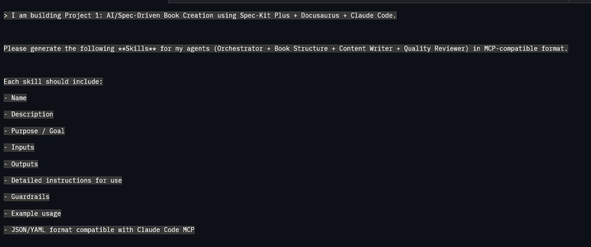
 
 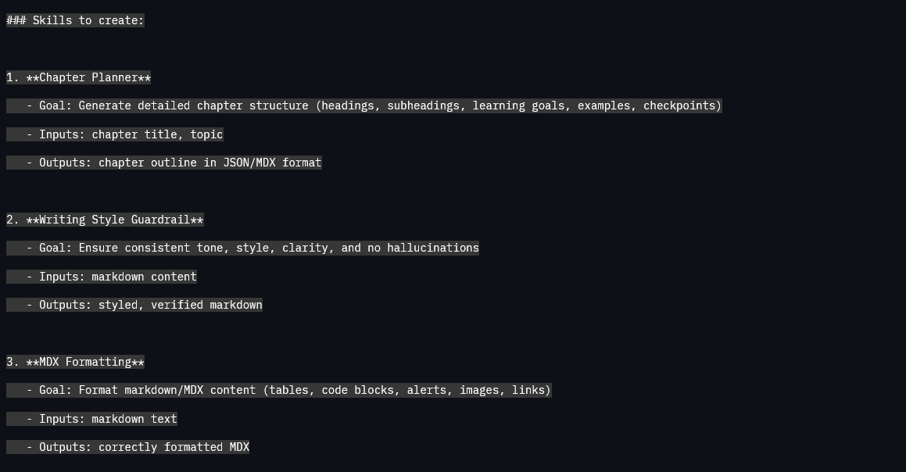
 
 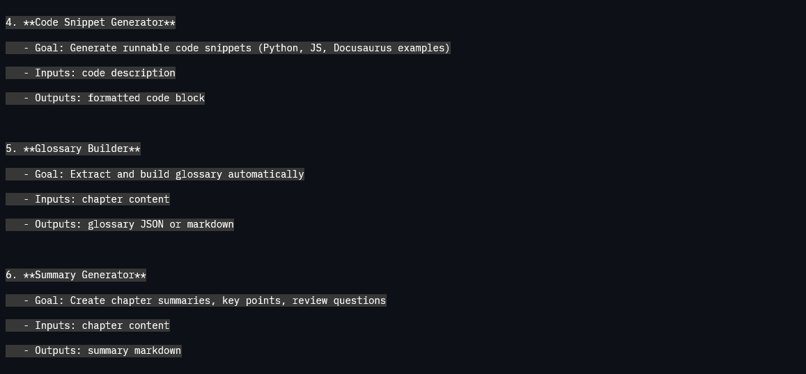
 
 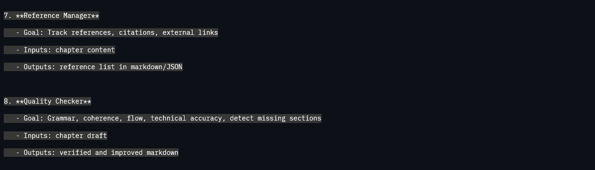
 
 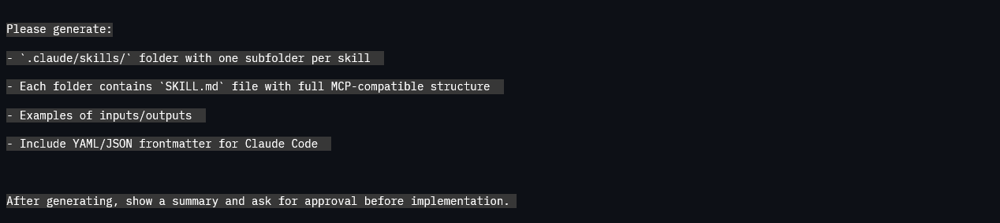
 
 ### 📂 Directory Sturcture:
 
 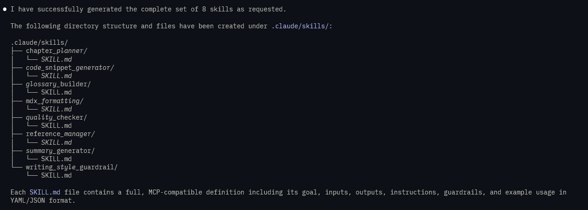
 
 ### 📃 List of Skills:
 
 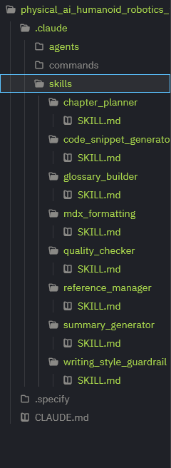
 
 ## 🎦 Skill.md Preview
 
 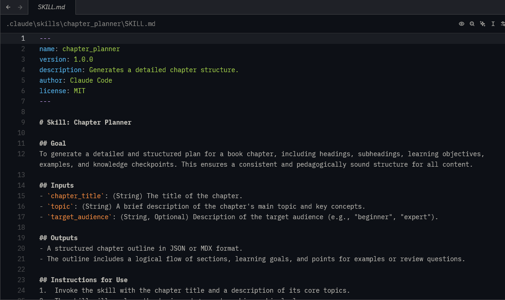
 
 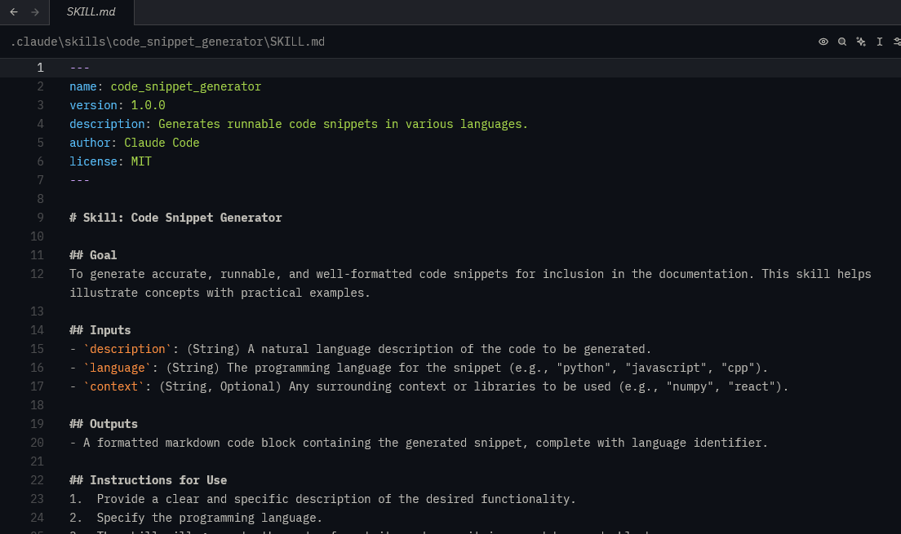
 
 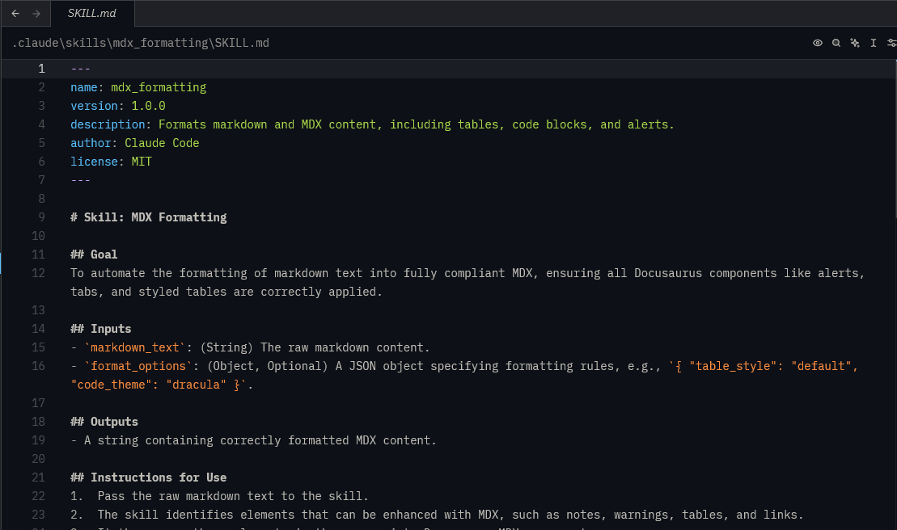
 
 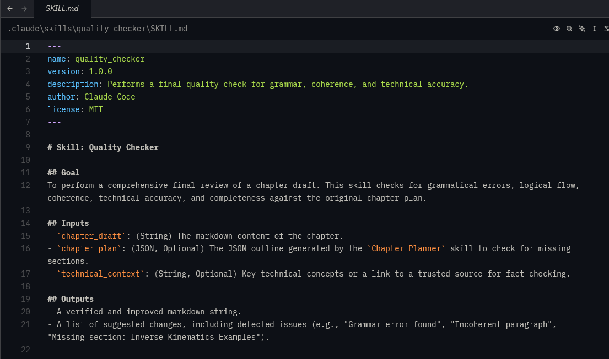
 
 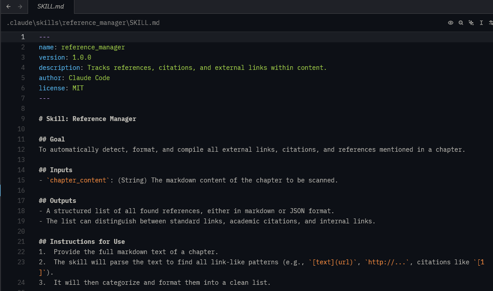