 # 🧠 AIDD 30-Day Challenge — Task 9 Submission
    Name: Tayyaba Hussain | Student ID: 00042883
    ⏱ Time: 1 Hour | Marks: 10 | Deadline: 3 Days
    📅 Class Slot: Friday — 6:00 PM to 9:00 PM
    Instructor: Sir Hamzah Syed
    
 # 🎯 Task Objective
 
 Students will learn and create Claude Code Skills and Sub-Agents for generating a book.
 
 Completing this task will also help you prepare for the upcoming Hackathon.
 
 # 🧠 Understanding the Concepts
 
 #### What are Sub-Agents?
 
 Sub-Agents are specialized AI agents that work together under a main orchestrator to handle different parts of a complex task.
 
 For example, in book writing:
 <li> One sub-agent researches
 <li> Another writes
 <li> Another edits
 <li> The orchestrator coordinates them all
 
 # 📚 Study Materials
 ### For Task 10 (Sub-Agents):
 Claude Code Sub-Agents Documentation(https://ai-native.panaversity.org/docs/AI-Tool-Landscape/claude-code-features-and-workflows/subagents-and-orchestration)

 ## Creating Custom Skills
 Learn how to create and orchestrate Sub-Agents that work together to write a complete book.
 
 ### Steps:
 1. Study the Sub-Agents and Orchestration documentation
 2. Create a book writing Sub-Agent that includes:
 <li> Main Orchestrator Agent
 <li> Research Sub-Agent
 <li> Writing Sub-Agent
 <li> Editing Sub-Agent
 <li> Formatting Sub-Agent

 💡 Tip: Focus on skills that add real value to the book writing workflow and can be reused in multiple projects.

# 📋 Submission Instructions
 ### Students must submit:
 <li> A clear screenshot of your VSCode Explorer showing the complete .claudecode directory structure
 <li> Submit your .md file in the 30-Day Challenge channel
 

 ### 📝 Prompt for Sub-Agents
 
 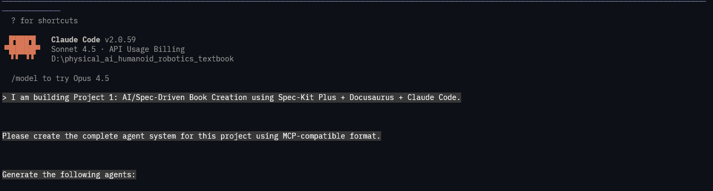
 
 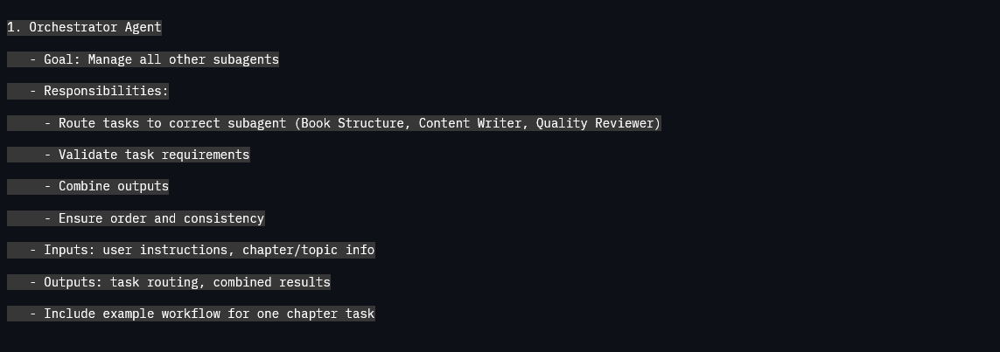
 
 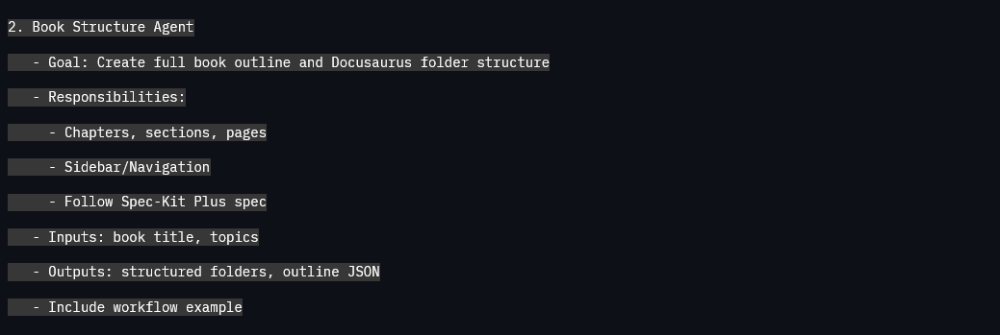
 
 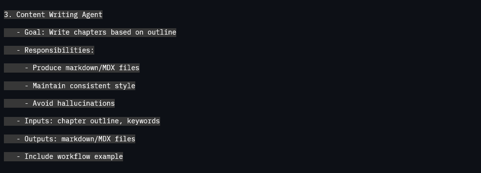
 
 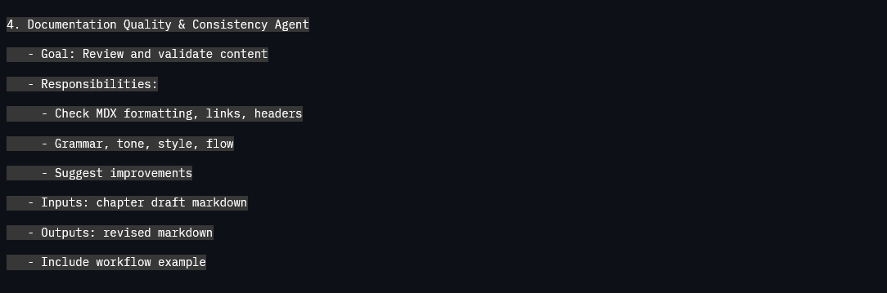
 
 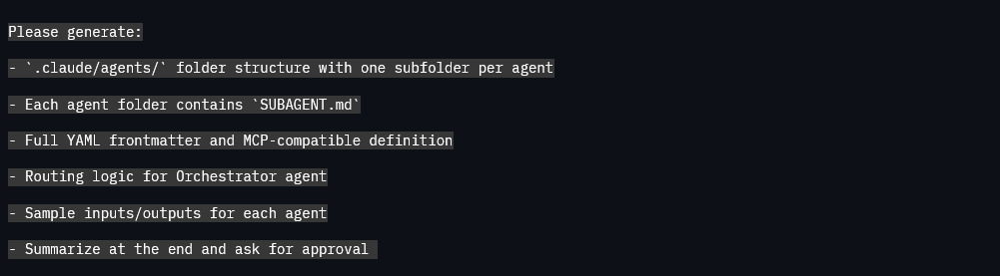
 
 ### 📃 List of Skills:
 
 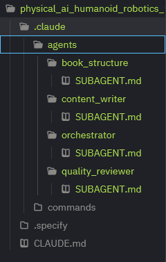
 
 ## 🎦 Sub-Agents.md Preview
 
 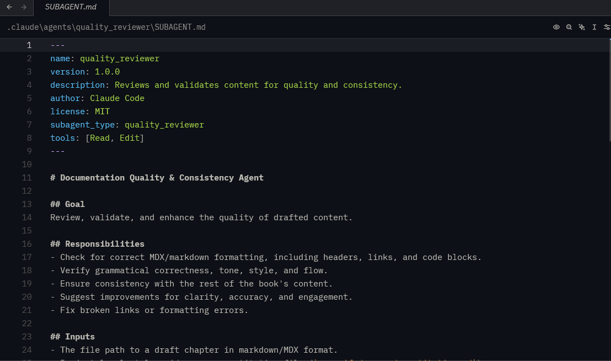
 
 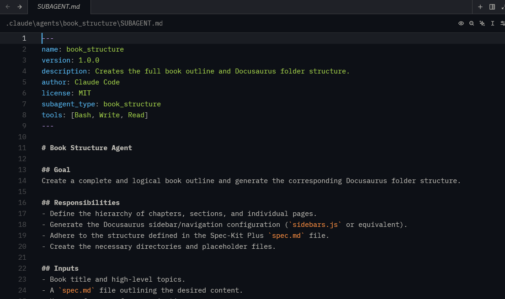
 
 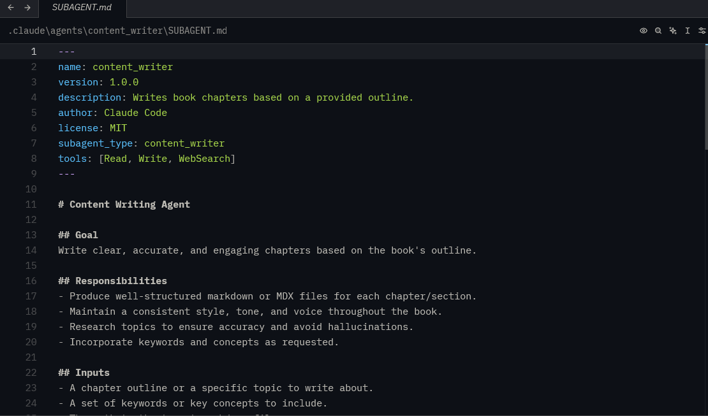
 
 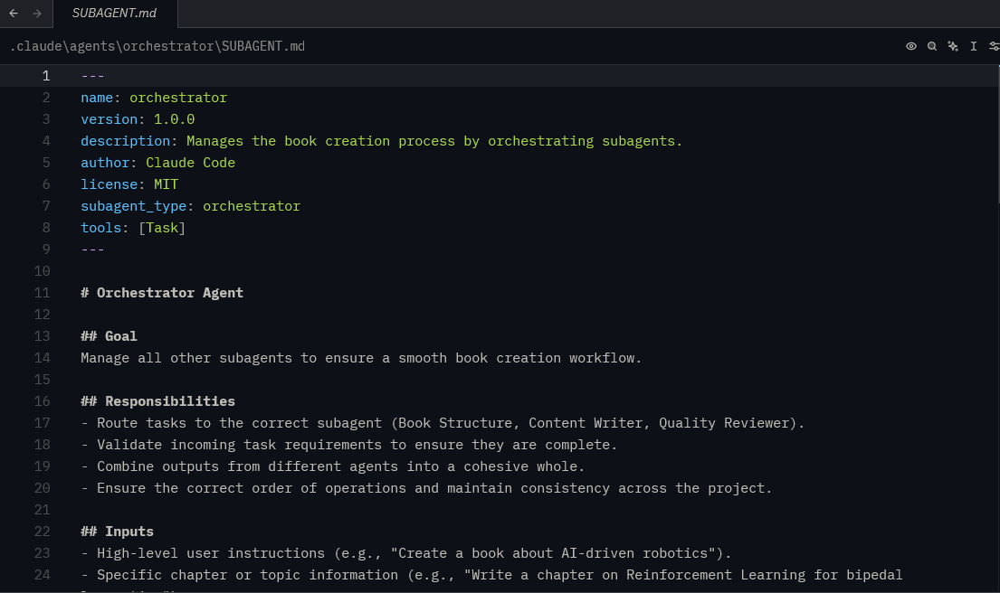